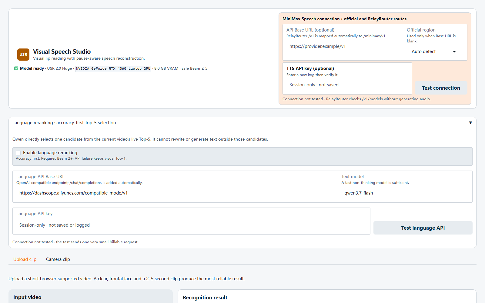

# Visual Speech Studio

面向全喉切除术后无喉者交流场景的**视觉唇语识别与自然语音重建研究原型**。系统只读取短视频中的口唇运动，先生成受视觉证据支持的候选句，再恢复停顿、呼吸或尾音节奏，最后通过 TTS（文本转语音）输出可播放语音。

> 当前为研究与演示原型，不是医疗器械，也尚未经过真实无喉者临床验证。仓库公开的是代码与开发集统计，不包含个人测试视频、API 密钥或 7.6 GB 模型权重。

<p align="center">
  
</p>

## Research question

普通唇语识别只回答“说了什么”。本项目进一步研究：在没有原始声音的情况下，能否同时保留**意思、停顿节奏、自然呼吸感和可识别的个人音色**，帮助无喉者获得更接近自然交流的输出。

```text
无声人脸视频
  → 嘴部区域提取
  → USR 2.0 视觉模型生成实时 Top-5 候选
  → 千问在视觉候选范围内重排（不能自由改写）
  → CTC 与嘴部运动共同定位停顿
  → MiniMax / ElevenLabs / Edge TTS 生成语音
```

### V4 development results

以下结果来自 30 个英文句子、每句独立录制两遍，共 60 段自建视频。它们已经参与参数选择，因此属于**开发集结果**，不能替代冻结参数后的独立测试集。

| 指标 | 视觉 Top-1 | 准确率优先语言重排 |
|:--|--:|--:|
| WER（词错误率，越低越好） | 18.85% | **15.57%** |
| 整句完全正确率 | 43.33% | **55.00%** |
| 核心意思可接受率 | 65.00% | **80.00%** |

Top-5 理论最优 WER 为 12.30%，说明视觉模型经常已经生成正确候选，只是原始排序不一定合理。准确率优先重排带来 17.39% 的相对 WER 降低，但仍有 6 段严格 WER 退化，所以系统保留视觉约束、失败回退和诊断信息。

停顿实验目前仍是薄弱环节：指定长停顿检出率为 50.00%，呼吸/尾音分类准确率为 22.22%。因此语气还原在本项目中是下一阶段研究目标，而不是已经完成的结论。

## Main contributions

- 将 USR 2.0 论文模型改造成可上传视频或调用摄像头的 Gradio 应用。
- 为 8 GB 显存设备加入安全 Beam 上限、显存释放和 CUDA 失败提示。
- 使用实时 Top-5 候选与千问重排，在提高句子合理性的同时禁止模型脱离视觉证据自由生成。
- 结合 CTC 空白概率与嘴部运动建立停顿时间线；超过 0.3 秒的停顿只使用无声呼吸或尾音，避免突兀的“uh/um”。
- 接入 MiniMax Speech-2.8 HD、ElevenLabs 和 Edge TTS，并支持官方端点与兼容代理地址。
- 建立 WER、CER、整句准确率、跨遍稳定性、Top-5 上限、语义准确率和停顿误差等评测脚本。
- 提供 37 项自动测试，覆盖视觉候选边界、API 失败回退、密钥不落盘和停顿渲染规则。

## Quick start

1. 按下方原论文说明安装依赖并下载 USR 2.0 Huge 权重，将权重放入 `checkpoint/`。
2. 安装 FFmpeg，并根据显卡环境安装 PyTorch。
3. 启动界面：

```bash
python gradio_app.py
```

4. 浏览器打开终端显示的本地地址。MiniMax 与千问密钥都可以只在页面会话中输入；不填密钥时，识别仍可运行，TTS 会回退到 Edge。

### Privacy and API boundary

- 输入视频与嘴部裁剪在本机处理。
- 可选语言重排只向文本 API 发送五个候选句，不发送视频。
- 可选云端 TTS 只接收最终文本和节奏标记。
- 页面密钥不写入文件、不写入日志，也不复制到进程环境变量。
- `.env`、测试视频、音频、模型权重、缓存和本地备份均由 `.gitignore` 排除。

## Research foundation: USR 2.0

**Pay Attention to CTC: Fast and Robust Pseudo-Labelling for Unified Speech Recognition**

A unified model for **audio**, **visual**, and **audio-visual** speech recognition.

[](https://arxiv.org/abs/2602.19316)

**Training paradigm:** USR 2.0 uses self-supervised pre-training followed by semi-supervised fine-tuning. We provide both the [self-supervised checkpoints](#self-supervised-encoder-only) (for extracting representations for your own downstream tasks) and the [fine-tuned checkpoints](#fine-tuned-full-model) (for speech recognition). See [Extract Encoder Features](#extract-encoder-features) for details on using either type.

<p align="center">
  
</p>

<p align="center">
  <a href="https://arxiv.org/abs/2602.19316">Paper</a> &bull;
  <a href="#installation">Installation</a> &bull;
  <a href="#transcribe-a-video">Demo</a> &bull;
  <a href="#extract-encoder-features">Features</a> &bull;
  <a href="#pretrained-models">Models</a> &bull;
  <a href="#evaluation">Evaluation</a> &bull;
  <a href="#citation">Citation</a>
</p>

---

## Installation

### Prerequisites

FFmpeg is required for video/audio processing. Check if it is installed:
```bash
ffmpeg -version
```

If not, install it:
```bash
# Ubuntu / Debian
sudo apt-get install ffmpeg

# macOS
brew install ffmpeg
```

### Step 1: Install PyTorch

Install PyTorch, torchaudio, and torchvision for your system from [pytorch.org](https://pytorch.org/get-started/locally/). For example:
```bash
pip install torch torchaudio torchvision --index-url https://download.pytorch.org/whl/cu121
```

### Step 2: Install remaining dependencies

```bash
pip install -r requirements.txt
```

This installs all remaining packages, including [MediaPipe](https://github.com/google-ai-edge/mediapipe) for face landmark detection (used for mouth cropping).

**Optional: Higher-accuracy face detection with RetinaFace+FAN**

MediaPipe is the default (CPU-based). For higher-accuracy landmark detection, install the ibug packages. This requires a CUDA GPU.

```bash
# face_detection uses git-lfs for model weights
git lfs install
GIT_LFS_SKIP_SMUDGE=1 git clone https://github.com/hhj1897/face_detection.git
cd face_detection
wget -O ibug/face_detection/retina_face/weights/Resnet50_Final.pth \
  https://huggingface.co/public-data/ibug-face-detection/resolve/main/retina_face/Resnet50_Final.pth
pip install -e .
cd ..

# face_alignment must be installed from a local clone (editable mode)
git clone https://github.com/hhj1897/face_alignment.git
pip install -e face_alignment
```

Then pass `detector=retinaface` to `demo.py` or `extract_features.py`.

---

## Transcribe a Video

Run `demo.py` to transcribe a video. Face detection and mouth cropping are handled automatically.

Download a pretrained model before running. The [Huge (high-resource)](https://drive.google.com/file/d/1LzFOTYu45zCLOHGVLQt7pMGjw6jmmo9Y/view?usp=sharing) checkpoint is recommended for best accuracy. For a lighter alternative, use [Base+ (high-resource)](https://drive.google.com/file/d/18vmJjdem5XPOA8bmizybIW5sLJuHMdRR/view?usp=sharing). See [Pretrained Models](#pretrained-models) for all options.

```bash
python demo.py \
  video=path/to/video.mp4 \
  model.pretrained_model_path=path/to/checkpoint.pth
```

Output:
```
============================================================
 Modality : av
 Video    : path/to/video.mp4
 Result   : THE QUICK BROWN FOX JUMPS OVER THE LAZY DOG
============================================================
```

### Modalities

```bash
# Audio-visual (default)
python demo.py video=video.mp4 model.pretrained_model_path=model.pth

# Lip reading only
python demo.py video=video.mp4 model.pretrained_model_path=model.pth modality=v

# Audio only
python demo.py video=video.mp4 model.pretrained_model_path=model.pth modality=a
```

### Face detector

By default, MediaPipe is used for face landmark detection. For higher accuracy, use RetinaFace+FAN (requires ibug packages and a CUDA GPU):

```bash
python demo.py video=video.mp4 model.pretrained_model_path=model.pth detector=retinaface
```

### Using a different model size

```bash
python demo.py video=video.mp4 model.pretrained_model_path=model.pth \
  model/backbone=resnet_transformer_large
```

Any [Hydra](https://hydra.cc/) override works. For example, to change beam size: `decode.beam_size=10`.

---

## Prosody-aware Gradio demo

The Gradio application keeps the decoded CTC token sequence, aligns it back to
the 25 FPS video, and combines inter-word CTC gaps with low mouth motion.  The
result is a conservative pause timeline used by speech synthesis.  It never
inserts lexical fillers such as `uh` or `um` because unsupported words would no
longer match the visible lip movements.

```bash
python gradio_app.py
```

### Accuracy-first Top-5 language reranking

The optional language reranker builds up to five unique beam hypotheses for
every current video and asks an OpenAI-compatible text API to score those
unchanged sentences. In the default accuracy-first mode, Qwen's selected
candidate is used directly. It cannot generate replacement text outside the
live Top-5. Timeout, malformed JSON, a missing key, or any API error
automatically keeps the original visual Top-1.

The default configuration targets Qwen Flash:

```text
API Base URL: https://dashscope.aliyuncs.com/compatible-mode/v1
Model: qwen3.7-flash
```

Open **Language reranking** in the page, enter a session-only API key, test the
connection, then enable reranking. The key is sent only in the Authorization
header and is never saved or logged. The diagnostics panel records the chosen
candidate, visual score drop, language score, and fallback reason.

The reranker needs Beam 2 or higher. On an 8 GB GPU the application retains its
existing safe Beam 5 limit. TTS remains independent and reads whichever
visually supported candidate the recognizer selects.

The 60-clip fixed N-best cache in `测试集` is an offline evaluation artifact
only. Online recognition never looks up that cache: each new video produces a
fresh live Top-5 before Qwen selects one candidate.

The speech panel has four modes:

- **Natural (automatic):** prefer MiniMax Speech-2.8 HD when
  `MINIMAX_API_KEY` is configured, then ElevenLabs v3, and finally Edge TTS.
- **Expressive AI (MiniMax Speech-2.8 HD):** use the domestic provider's exact
  `<#seconds#>` pause controls and `(breath)`/`(inhale)` audio events.
- **Expressive AI (ElevenLabs v3):** require the expressive provider and use
  pause/breath audio tags.
- **Standard (Edge TTS):** always use the no-key-compatible provider.

MiniMax is the recommended provider for this project because its API can
express both measured pause duration and audible non-lexical breathing. Enable
it by pasting a newly generated key into the password field at the top of the
Gradio page, selecting the account region, and clicking **Verify key**. Auto
detect checks the official global endpoint first, then the Mainland China
endpoint, using MiniMax's non-billable voice-list API. The value is passed only
to the validation or synthesis request and is not written to a file or copied
into the process environment. The result panel always states whether MiniMax or
the Edge fallback actually generated the audio.

If the key comes from a relay or self-managed MiniMax-compatible service, enter
its **API Base URL** in the same connection panel. Both `https://host` and
`https://host/v1` forms are accepted; the application avoids duplicating the
`/v1` segment. The relay must expose the native MiniMax-compatible
`/v1/get_voice` and `/v1/t2a_v2` routes. Leave the field blank to use the
official Global/Mainland China region selector. The URL, like the session key,
is not saved.

RelayRouter is supported as a special MiniMax-native gateway. When the UI receives
`https://api.relayrouter.ai/v1`, it validates the key with `GET /v1/models` and
routes synthesis to `POST /minimax/v1/t2a_v2`. The model group attached to the
key must include `speech-2.8-hd`.

For a dedicated local machine, the existing environment-variable option is
also supported:

```powershell
$env:MINIMAX_API_KEY = "your-api-key"
# Optional: override auto-detection with an official or self-managed endpoint.
# Global: https://api.minimax.io
# Mainland China: https://api.minimax.cn
$env:MINIMAX_API_BASE = "https://api.minimax.cn"
# Optional: choose another MiniMax system or cloned voice.
$env:MINIMAX_VOICE_ID = "English_Trustworthy_Man"
# Optional: calm, fluent, happy, sad, angry, fearful, disgusted, or surprised.
$env:MINIMAX_EMOTION = "calm"
python gradio_app.py
```

ElevenLabs remains available as a compatible alternative:

```powershell
$env:ELEVENLABS_API_KEY = "your-api-key"
# Optional: override the default George voice.
$env:ELEVENLABS_VOICE_ID = "your-voice-id"
python gradio_app.py
```

API keys and `.env` files are ignored by Git.  Speech timing is inferred from
visual evidence, but pitch and true vocal emotion cannot be recovered exactly
from a silent video; the expressive provider generates a restrained plausible
delivery instead.

---

## Extract Encoder Features

Extract learned audio-visual representations for your own downstream tasks (e.g., emotion recognition, speaker verification, audio-visual synchronization).

While `demo.py` uses the full model (encoder + decoder) for transcription, `extract_features.py` outputs only the encoder representations.

You can extract features from two types of checkpoints:
- **Fine-tuned models** (self-supervised + semi-supervised): Best for tasks that benefit from supervised speech knowledge
- **Self-supervised models**: Pure self-supervised representations, useful if you want to fine-tune on a task that requires more general knowledge.

See [Pretrained Models](#pretrained-models) for download links.

```bash
# Using a fine-tuned checkpoint
python extract_features.py \
  video=path/to/video.mp4 \
  model.pretrained_model_path=path/to/finetuned_checkpoint.pth \
  output=features.pt

# Using a self-supervised checkpoint
python extract_features.py \
  video=path/to/video.mp4 \
  model.pretrained_model_path=path/to/selfsup_checkpoint.pth \
  output=features.pt

# Single modality
python extract_features.py \
  video=path/to/video.mp4 \
  model.pretrained_model_path=path/to/checkpoint.pth \
  modality=v output=video_features.pt

# Use RetinaFace+FAN for face detection (optional, requires ibug packages)
python extract_features.py \
  video=path/to/video.mp4 \
  model.pretrained_model_path=path/to/checkpoint.pth \
  detector=retinaface output=features.pt
```

Load in Python:

```python
import torch

features = torch.load("features.pt")
features["audio_visual"]  # numpy array, shape (T, D) — fused audio-visual encoder output
features["video"]          # numpy array, shape (T, D) — visual encoder output
features["audio"]          # numpy array, shape (T, D) — audio encoder output
```

---

## Pretrained Models

### Self-supervised (encoder only)

These are self-supervised pre-trained checkpoints from [USR](https://github.com/ahaliassos/usr). Use these if you want to extract representations without any supervised fine-tuning, e.g., to fine-tune for your own downstream task.

| Model | Data | Download |
|:------|:-----|:---------|
| Base | LRS3 | [checkpoint](https://drive.google.com/file/d/1AZ3JT8zubow-oZ5LJUrMd97GLWmAKfK0/view?usp=sharing) |
| Base+ | LRS3+Vox2 | [checkpoint](https://drive.google.com/file/d/1wCxpChDQySPraGICZ9QCW9Nzo-EYtX-g/view?usp=sharing) |
| Large | LRS3+Vox2 | [checkpoint](https://drive.google.com/file/d/18dBUcP9XvRIVZmDw8XTpxD8DKReTpOSI/view?usp=sharing) |
| Huge | LRS2+LRS3+Vox2+AVS | [checkpoint](https://drive.google.com/file/d/1KARf06-70SpI6kkHfoaaiDksL-1M_ojy/view?usp=sharing) |

### Fine-tuned (full model)

These checkpoints have been fine-tuned with semi-supervised learning for speech recognition. Use these for transcription (`demo.py`) or to extract features that include supervised speech knowledge.

### Low-resource

| Model | Data | VSR (%) | ASR (%) | AVSR (%) | Download |
|:------|:-----|--------:|--------:|---------:|:---------|
| Base | LRS3 | 36.2 | 3.0 | 2.9 | [checkpoint](https://drive.google.com/file/d/1S-gTw2K-AaYAZFQFknx50-ymaj4qTfcX/view?usp=sharing) |
| Base+ | LRS3+Vox2 | 26.4 | 2.5 | 2.4 | [checkpoint](https://drive.google.com/file/d/15K4I2eYHU0CzjsUSRdWickU9dIX0fFAh/view?usp=sharing) |
| Large | LRS3+Vox2 | 23.7 | 2.3 | 2.2 | [checkpoint](https://drive.google.com/file/d/1FIculf1Mfo73Y2f_dSu-HDw1Jb36pW-r/view?usp=sharing) |

### High-resource

| Model | Data | VSR (%) | ASR (%) | AVSR (%) | Download |
|:------|:-----|--------:|--------:|---------:|:---------|
| Base+ | LRS3+Vox2 | 24.8 | 1.4 | 1.2 | [checkpoint](https://drive.google.com/file/d/18vmJjdem5XPOA8bmizybIW5sLJuHMdRR/view?usp=sharing) |
| Large | LRS3+Vox2 | 21.5 | 1.3 | 1.0 | [checkpoint](https://drive.google.com/file/d/1XDNLfZMv_nn8ALiFmDh3asrJKGC2uHs1/view?usp=sharing) |
| Huge | LRS2+LRS3+Vox2+AVS | 17.6 | 0.9 | **0.8** | [checkpoint](https://drive.google.com/file/d/1LzFOTYu45zCLOHGVLQt7pMGjw6jmmo9Y/view?usp=sharing) |

Backbone configs: `resnet_transformer_base` / `resnet_transformer_baseplus` / `resnet_transformer_large` / `resnet_transformer_huge`.

---

## Evaluation

Evaluate on a test set with WER computation:

```bash
python main.py \
  data.dataset.test_csv=path/to/test.csv \
  model/backbone=resnet_transformer_base \
  model.pretrained_model_path=path/to/checkpoint.pth
```

Greedy decoding:

```bash
python main.py ... decode.beam_size=1 decode.ctc_weight=0.0
```

<details>
<summary>Decoding parameters</summary>

| Parameter | Default | Description |
|:----------|:--------|:------------|
| `decode.beam_size` | 40 | Beam search width |
| `decode.ctc_weight` | 0.1 | CTC weight (0.0 = pure attention) |
| `decode.maxlenratio` | 1.0 | Max output length ratio |

**Speed tip:** For faster decoding at the cost of some accuracy, reduce the beam size and disable CTC rescoring:
```bash
decode.beam_size=1 decode.ctc_weight=0.0
```
The default (`beam_size=40`, `ctc_weight=0.1`) gives the best results but is slower. Intermediate values (e.g., `beam_size=10`) offer a middle ground.

</details>

---

## Reproducing Paper Results

<details>
<summary><b>Robustness to noise</b></summary>

| Modality | 10 dB | 5 dB | 0 dB | -5 dB | Avg |
|:---------|------:|-----:|-----:|------:|----:|
| ASR | 5.2 | 13.4 | 44.0 | 94.4 | 39.3 |
| AVSR | 3.7 | 5.6 | 14.0 | 33.1 | 14.1 |

```bash
python main.py \
  model/backbone=resnet_transformer_base \
  model.pretrained_model_path=path/to/checkpoint.pth \
  data.dataset.test_csv=path/to/test.csv \
  data.noise_path=path/to/babble_noise.npy \
  decode.beam_size=30 decode.ctc_weight=0.1 \
  decode.maxlenratio=0.4 decode.snr_target=0
```

Babble noise: [download](https://drive.google.com/file/d/1d8D6FcsftCotnE14nu9C2q1v6N0KnYCC/view?usp=sharing)

</details>

<details>
<summary><b>Robustness to long utterances</b></summary>

<p align="center"></p>

```bash
python main.py \
  data.frames_per_gpu_val=700 \
  model/backbone=resnet_transformer_base \
  model.pretrained_model_path=path/to/checkpoint.pth \
  data.dataset.test_csv=path/to/length_bucket.csv \
  decode.beam_size=1 decode.ctc_weight=0.0 \
  decode.maxlenratio=0.4
```

Length-bucketed test CSVs:
[100-150](https://drive.google.com/file/d/1wEkQQTtHRDidlZlkyMuYZRyad2ETR_n-/view?usp=sharing) |
[150-200](https://drive.google.com/file/d/16Iw3BFvrzJUM6-0JK4jD2bJU9IXJZ6fp/view?usp=sharing) |
[200-250](https://drive.google.com/file/d/173_aTcd7GOHEzJSEA5ZrSZ1NyzRkbWG3/view?usp=sharing) |
[250-300](https://drive.google.com/file/d/1N-cqlLc0CLZRU1VS0Ww1zcXeaNlJp_mJ/view?usp=sharing) |
[300-350](https://drive.google.com/file/d/1GWSUgVaSVLu1x9SCeOOwedLVQwHNyEoh/view?usp=sharing) |
[350-400](https://drive.google.com/file/d/1OHhStEacguOIjRCjWMvYXI17JwtbhEY4/view?usp=sharing) |
[400-450](https://drive.google.com/file/d/179xVv5LdefBjMa3zchKzbGzTkAgrJFPM/view?usp=sharing) |
[450-500](https://drive.google.com/file/d/1Y-2obSGIJxwJ-wrzwBR9IdJ_jAALLIVj/view?usp=sharing) |
[500-550](https://drive.google.com/file/d/114drg2q-Lj2kfM81AF1-SfmCAzQMHeyK/view?usp=sharing) |
[550-600](https://drive.google.com/file/d/1Fo2sUhyChYEcJzmiFheA3bXsZxR958_E/view?usp=sharing) |
[Combined](https://drive.google.com/file/d/14psWYLi9Qmo80pIBIEOH0IaYwlevPqdy/view?usp=sharing)

</details>

<details>
<summary><b>Out-of-distribution datasets</b></summary>

| Modality | Dataset | WER (%) |
|:---------|:--------|--------:|
| ASR | LibriSpeech test-clean | 15.4 |
| VSR | WildVSR | 73.7 |
| AVSR | AVSpeech | 25.0 |

```bash
python main.py \
  data.frames_per_gpu_val=700 \
  model/backbone=resnet_transformer_base \
  model.pretrained_model_path=path/to/checkpoint.pth \
  data.dataset.test_csv=path/to/test.csv \
  decode.beam_size=1 decode.ctc_weight=0.0 \
  decode.maxlenratio=0.4
```

Test CSVs:
[LibriSpeech](https://drive.google.com/file/d/1F0ewDWVjFeZ9ZAs7E251rSJEFsI8_C1o/view?usp=sharing) |
[WildVSR](https://drive.google.com/file/d/1WHaH9vupxV4YP4rAKCeDiWBc9FIU6P0B/view?usp=sharing) |
[AVSpeech](https://drive.google.com/file/d/1CBFCfM3xcZ--TAkyEOYippAaf41v7p5r/view?usp=sharing)

</details>

---

## Data Preparation

<details>
<summary><b>Full data preparation instructions (for batch evaluation)</b></summary>

### 1. Download datasets

> **Note:** Several of these datasets are no longer available for download from their official sources. Unfortunately there is nothing we can do about this. If you need access to a specific dataset, we recommend contacting the original authors directly.

- [LRS3](https://www.robots.ox.ac.uk/~vgg/data/lip_reading/lrs3.html)
- [LRS2](https://www.robots.ox.ac.uk/~vgg/data/lip_reading/lrs2.html)
- [VoxCeleb2](https://www.robots.ox.ac.uk/~vgg/data/voxceleb/vox2.html)
- [AVSpeech](https://looking-to-listen.github.io/avspeech/)
- [LibriSpeech](https://www.openslr.org/12)

### 2. Extract mouth ROIs

```bash
python preprocessing/extract_mouths.py \
  --src_dir /path/to/raw/videos \
  --tgt_dir /path/to/mouth/videos \
  --landmarks_dir /path/to/landmarks
```

Pre-computed landmarks for LRS2 and LRS3 can be downloaded from the [Visual Speech Recognition repo](https://github.com/mpc001/Visual_Speech_Recognition_for_Multiple_Languages/tree/master).

### 3. Download test CSVs

| Split | Link |
|:------|:-----|
| LRS3 test | [download](https://drive.google.com/file/d/1eOZXM5LiJOK92EzXMC-eDyFtUKlNGIUJ/view?usp=sharing) |
| LRS3 trainval | [download](https://drive.google.com/file/d/1AvdYktN5OKc8eNcwO-Xn9N9hSlwD0dQK/view?usp=sharing) |
| LRS3 train | [download](https://drive.google.com/file/d/11NeU9zqNlFeHYmpr6CxnXANsCZyZdcu1/view?usp=sharing) |
| LRS3 val | [download](https://drive.google.com/file/d/17h7HwysmhrFVFImBWIQZUCMJ8xkrMkgZ/view?usp=sharing) |
| LRS3+Vox2 | [download](https://drive.google.com/file/d/1cRhgQdNYUniEaH7a-E7YjfdEDJJ3N16f/view?usp=sharing) |
| LRS2+LRS3+Vox2+AVS | [download](https://drive.google.com/file/d/1DX4Afk_yn5fMgWHPEMilZotRLBfCu1cU/view?usp=sharing) |

### 4. Set dataset paths

Edit `conf/data/default.yaml` and set the video/audio directory prefixes for each dataset.

</details>

---

## Architecture

<p align="center"></p>

---

## Repository Structure

```
.
├── demo.py                   # Transcribe a single video
├── extract_features.py       # Extract encoder features
├── main.py                   # Batch evaluation with WER
├── evaluator.py              # PyTorch Lightning evaluation module
├── models/usr.py             # USR model wrapper
├── data/                     # Dataset, transforms, samplers
├── preprocessing/            # Face detection + mouth cropping
├── espnet/                   # Vendored ESPnet (transformer, beam search, CTC)
├── conf/                     # Hydra configuration
└── utils/utils.py            # Tokenization
```

---

## Citation

```bibtex
@article{haliassos2026pay,
  title={Pay Attention to CTC: Fast and Robust Pseudo-Labelling for Unified Speech Recognition},
  author={Haliassos, Alexandros and Mira, Rodrigo and Petridis, Stavros},
  journal={arXiv preprint arXiv:2602.19316},
  year={2026}
}
```

## Acknowledgements

This codebase builds on [ESPnet](https://github.com/espnet/espnet), [PyTorch Lightning](https://github.com/Lightning-AI/pytorch-lightning), and [Hydra](https://github.com/facebookresearch/hydra). Preprocessing code is adapted from [Visual Speech Recognition for Multiple Languages](https://github.com/mpc001/Visual_Speech_Recognition_for_Multiple_Languages).
